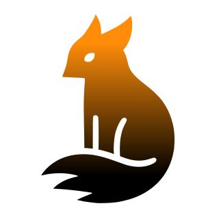

<p align="center">
  
</p>

<h1 align="center">🏗️ Kreate</h1>

<p align="center">
  <a href="https://opensource.org/licenses/Apache-2.0">
    
  </a>
  <a href="https://kotlinlang.org">
    
  </a>
  <a href="https://gradle.org">
    
  </a>
</p>

<p align="center">
  <strong>Kreate</strong> is an opinionated Gradle helper plugin for building Kotlin Multiplatform (KMP) and JVM projects.
  It provides a unified DSL to manage platform configurations, native C-Interop (Rust), JNI, documentation, testing, and publishing workflows with minimal boilerplate.
</p>

---

## 📋 Table of Contents

- [Overview](#-overview)
- [Core Features](#-core-features)
- [Quick Start](#-quick-start)
- [Configuration Reference](#-configuration-reference)
- [Documentation](#-documentation)
- [Third-Party Software](#-third-party-software)
- [Contributing](#-contributing)
- [License & Ethics](#-license--ethics)

---

## 🔍 Overview

Managing Kotlin Multiplatform and JVM configurations can be complex. **Kreate** simplifies this by:

*   **Standardizing Platform Setup**: A consistent DSL for JVM, Linux, macOS, and Windows.
*   **Integrating Native Code**: Automated bridge for Rust (via C-Interop) and C/C++ (via JNI).
*   **Enforcing Quality Standards**: Sensible defaults like `explicitApi()` and `allWarningsAsErrors`.
*   **Declarative Infrastructure**: Focus on project requirements while the plugin handles the underlying Gradle configuration.

---

## ✨ Core Features

### 🏗️ Platform Support
Kreate detects the project type (JVM, Android, or KMP) and applies appropriate optimizations:
- **JVM Support**: Configures Java 21+ toolchains and compiler options.
- **Multiplatform DSL**: Unified targets for Linux, macOS, and Windows.
- **Consistent Toolchains**: Ensures Java and Kotlin versions are synchronized across modules.

### 🦀 Rust C-Interop
Automates the integration of Rust libraries into Kotlin Multiplatform:
- **Toolchain Integration**: Manages `cargo` and cross-compilation targets.
- **Project Scaffolding**: Can generate Rust library structures if missing.
- **Header Synchronization**: Manages C headers and Kotlin bindings.
- **Multi-Arch Support**: Targets `x86_64`, `aarch64`, and others.

### 🔌 JNI Support (Java Native Interface)
Simplified integration for native C/C++ code in JVM projects:
- **CMake Integration**: Automatically handles CMake-based native builds.
- **Runtime Library Path**: Automatically configures `java.library.path` for testing and execution.
- **Consistent Layout**: Follows a structured layout for native sources (mirroring C-Interop style).

### 🧪 Testing Pipeline
Pre-configured **Kotest** integration for robust validation:
- **Parallel Execution**: Scales based on CPU availability.
- **Standardized Logging**: Clear output for test states (Passed, Skipped, Started).
- **Automated Reporting**: Generates HTML and XML reports for CI/CD.

### 📦 Publishing & POM Management
Standardizes the release process for libraries:
- **Registry Support**: Built-in configurations for Maven Central and GitLab.
- **Signing**: Integrated GPG signing for Maven Central requirements.
- **POM Metadata**: Declarative DSL for licenses, developers, and SCM information.

---

## 📖 Documentation

Detailed documentation for Kreate is available in the following locations:

- **[Project Docs](./docs)**: Comprehensive guides and topic-specific information.
- **[API Reference](https://davils.github.io/kreate/api)**: Dokka-generated API documentation.
- **[Examples](./example)**: A reference implementation demonstrating various configuration scenarios.

To generate the documentation locally, run:
```bash
./gradlew dokkaHtml
```

---

## 🛠️ Quick Start

### Installation

Add the plugin to your `settings.gradle.kts` (recommended) or `build.gradle.kts`:

```kotlin
pluginManagement {
    repositories {
        mavenCentral()
        gradlePluginPortal()
    }
}

plugins {
    id("com.davils.kreate") version "<latest>"
}
```

### Configuration

Apply the plugin in your `build.gradle.kts`:

```kotlin
kreate {
    platform {
        javaVersion = JavaVersion.VERSION_25
        explicitApi = true
        
        jvm {
            jni {
                enabled = true
                // Optional: projectDirectory = file("custom-jni-path")
            }
        }
        
        multiplatform {
            cInterop {
                enabled = true
                rustTargets = listOf("x86_64-unknown-linux-gnu", "aarch64-apple-darwin")
            }
        }
    }

    project {
        name = "MyProject"
        description = "A project powered by Kreate"
        
        publish {
            enabled = true
            repositories {
                mavenCentral {
                    enabled = true
                    automaticRelease = true
                }
            }
        }
    }
}
```

---

## ⚙️ Configuration Reference

| Block      | Property              | Description                               | Default      |
|:-----------|:----------------------|:------------------------------------------|:-------------|
| `platform` | `javaVersion`         | Target Java version (21, 25, etc.)        | `VERSION_21` |
| `platform` | `explicitApi`         | Enforces Kotlin Explicit API mode         | `false`      |
| `platform` | `allWarningsAsErrors` | Treats all compiler warnings as errors    | `true`       |
| `jvm.jni`  | `enabled`             | Enables JNI support (CMake-based)         | `false`      |
| `project`  | `buildConstant`       | Generate type-safe Kotlin constants       | `Disabled`   |
| `project`  | `docs`                | Configure Dokka documentation generation  | `Disabled`   |
| `project`  | `tests`               | Advanced Kotest configuration & reporting | `Enabled`    |
| `project`  | `publish`             | Maven Central / GitLab publishing setup   | `Disabled`   |

---

## 📦 Third-Party Software

Kreate leverages various open-source technologies. For a full list of libraries and licenses, please refer to the [Third-Party Software](./THIRDPARTY.md) document.

---

## 🤝 Contributing

We welcome all contributions! To maintain quality, please note:

- **Documentation**: Changes to API or behavior must be documented.
- **Tests**: Ensure your changes are covered by tests.
- **Standards**: Follow the established Kotlin style and project conventions.

Detailed instructions can be found in our [Contributing Guidelines](CONTRIBUTING.md).

---

## ⚖️ License & Ethics

- **License**: Published under the **Apache License 2.0**. See `LICENSE` for details.
- **Code of Conduct**: We adhere to our [Code of Conduct](CODE_OF_CONDUCT.md).

---

<p align="center">
  Maintained by <a href="https://github.com/davils-com"><b>Davils</b></a>
</p>
