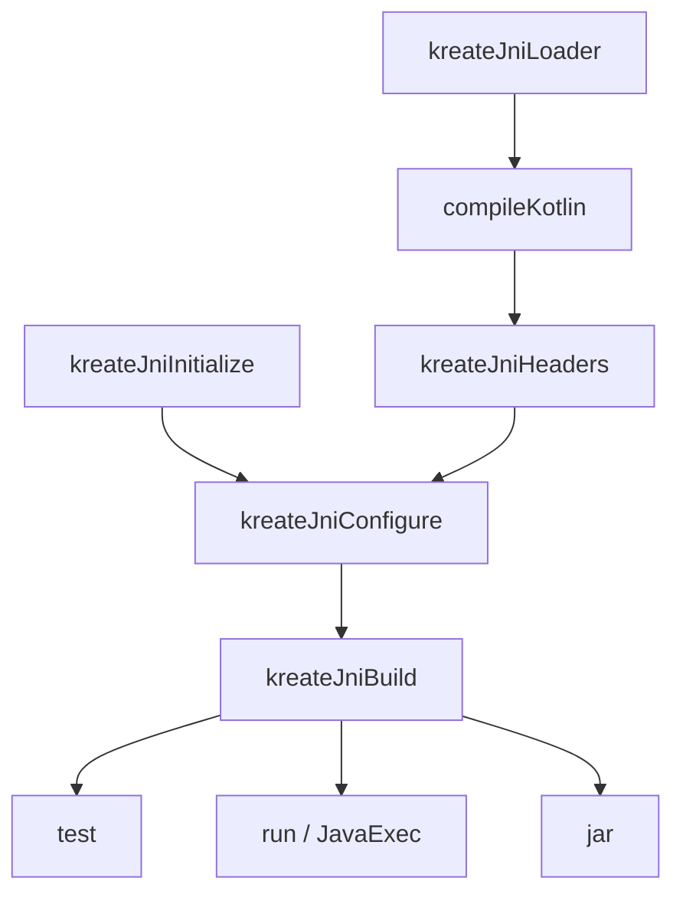

# Build pipeline

<link-summary>
The task graph behind a JNI build, and the correctness properties each stage guarantees.
</link-summary>

<card-summary>
Five tasks, what triggers each of them, and how incremental builds stay correct.
</card-summary>

## The task graph



Two things about this graph are worth stating explicitly, because both differ from the obvious
arrangement:

<deflist type="wide">
    <def title="The native build runs after Kotlin compilation, not before">
        The headers are derived from compiled <code>external</code> declarations, so generating
        them before compilation is impossible. Building afterwards is also simply correct:
        nothing on the JVM side needs a shared library until something is executed. Test, run,
        and packaging tasks depend on the library; <code>compileKotlin</code> does not.
    </def>
    <def title="Configure is separate from build">
        Re-running CMake's generator is the expensive half of a native build. Splitting it means
        an ordinary C++ edit skips it entirely.
    </def>
</deflist>

## kreateJniInitialize

Scaffolds the native project when it does not exist yet. Existing files are never overwritten.

See [Scaffolding](JNI-Scaffolding.md) for what is generated.

## kreateJniHeaders

Reads the compiled classes, finds `native` methods, and writes the JNI declarations to
`build/generated/jni/include/`. That directory is added to the CMake include path automatically.

See [Header generation](JNI-Headers.md).

## kreateJniConfigure

Runs the CMake configure step:

```bash
cmake -S jni/<name> -B build/jni/<os>-<arch>/cmake \
      -DCMAKE_BUILD_TYPE=Release \
      -DJAVA_HOME=<toolchain JDK> \
      -DCMAKE_LIBRARY_OUTPUT_DIRECTORY=build/jni/<os>-<arch>/lib \
      -DKREATE_JNI_INCLUDE_DIRS=<generated headers>;<your include paths>
```

Three of those arguments exist to prevent a specific failure:

<deflist type="wide">
    <def title="-DJAVA_HOME">
        <code>find_package(JNI)</code> otherwise picks whichever JDK the machine defaults to.
        On a machine with several JDKs installed, that silently compiles your native code
        against different headers than your Kotlin code targets. The value comes from the Gradle
        toolchain, so the two always agree.
    </def>
    <def title="-DCMAKE_LIBRARY_OUTPUT_DIRECTORY (and the per-configuration variants)">
        Multi-configuration generators — Visual Studio and Xcode — append the configuration name
        to the output path, producing <code>lib/Release/foo.dll</code> where single-configuration
        generators produce <code>lib/foo.so</code>. Pinning the per-configuration variables as
        well is what makes the artifact land in one known place on every platform, which is what
        <code>java.library.path</code> and the packaging step depend on.
    </def>
    <def title="-DKREATE_JNI_INCLUDE_DIRS">
        Carries the generated header directory and your configured
        <code>libraryIncludePaths</code>. Passing them as a cache variable rather than writing
        them into <code>CMakeLists.txt</code> means changing the configuration takes effect
        immediately — %product% deliberately never rewrites that file once it exists.
    </def>
</deflist>

### When configuration re-runs

The configure step is tracked against `CMakeLists.txt`, the build type, the generator, the JDK,
the include paths, **and the absolute source and build directory paths**.

That last input is unusual and deliberate. `CMakeCache.txt` records the paths it was generated
for and refuses to be reused from anywhere else:

```
CMake Error: The current CMakeCache.txt directory /new/path/build is different
than the directory /old/path/build where CMakeCache.txt was created.
```

Declaring the paths as an input is what makes Gradle reconfigure after the project is renamed,
moved, or checked out at a different path on a build agent — instead of handing CMake a cache it
will reject.

## kreateJniBuild

Runs the build step:

```bash
cmake --build build/jni/<os>-<arch>/cmake --config Release
```

### When the build re-runs

Tracked against every file the native build reads: `CMakeLists.txt`, everything under `src/` and
`include/`, and the generated headers.

<warning>
This is not a formality. A Gradle task that declares outputs but no relevant inputs is considered
up to date as long as its outputs are untouched — meaning edits to C++ sources would produce no
rebuild, and the JVM would keep loading a stale shared library while the build reported success.
Declaring the sources is what makes the incremental behaviour correct.
</warning>

### When it fails

The full CMake, compiler, and linker output is captured and attached to the failure:

```
CMake build failed with exit code 2.

Command:           /usr/bin/cmake --build /path/build/jni/linux-x86_64/cmake --config Release
Working directory: /path/build/jni/linux-x86_64/cmake
JAVA_HOME:         /usr/lib/jvm/temurin-21

CMake output:
/path/jni/my_module/src/my_module.cpp:7:5: error: unknown type name 'jstrng'
```

An exit code on its own gives you nothing to act on; the diagnostic does.

## kreateJniLoader

Generates the `KreateNativeLoader` object when [packaging](JNI-Packaging.md) is enabled. It is
generated as source into your module, so no runtime dependency on %product% is introduced.

## Runtime library resolution

Every `Test` and `JavaExec` task gains a dependency on `kreateJniBuild` and the argument:

```
-Djava.library.path=build/jni/<os>-<arch>/lib
```

The value is contributed through a Gradle argument provider rather than by mutating `jvmArgs`.
That keeps it lazy — so it survives configuration cache reuse — and additive, so a library path
your build configured for its own reasons is preserved rather than filtered away.

Additional directories can be appended:

```kotlin
jni {
    enabled = true
    libraryRuntimePaths = listOf("/opt/vendor/lib", "libs/native")
}
```

## Build types

```kotlin
jni {
    enabled = true
    buildType = "Debug"
}
```

<tip>
Use <code>Debug</code> when attaching a native debugger to the JVM. The build type is a tracked
input, so switching it triggers a rebuild rather than silently reusing optimised objects.
</tip>

<seealso>
    <category ref="native">
        <a href="JNI-Support.md">JNI support</a>
        <a href="JNI-Configuration.md">Configuration reference</a>
        <a href="JNI-Troubleshooting.md">Troubleshooting</a>
    </category>
    <category ref="reference">
        <a href="Task-Reference.md">Task reference</a>
    </category>
</seealso>
